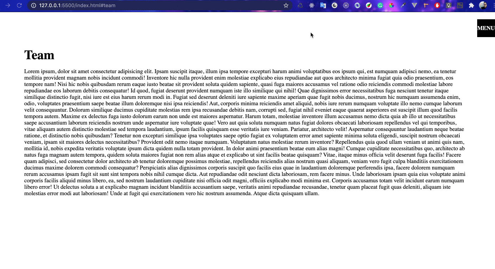

# css-effects-sidebar-menu-smooth-scroll

> **HTML section id** | **a href** | **scroll-behavior: smooth** | **overflow-x: hidden** | **input [type="checkbox"]** | **z-index** | **input[type="checkbox"]:checked ~ .icon::before** | **input[type="checkbox"]:checked ~ ul** | **transform: translateX** | **&::before {content: 'close';**

# Demo

